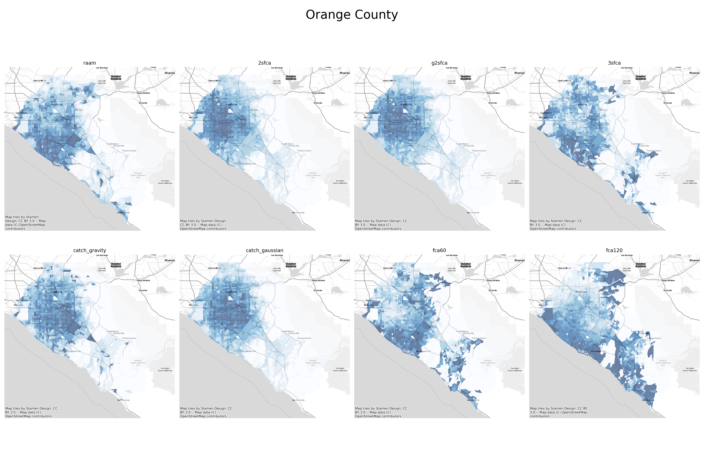

# healthacc

measuring multimodal accessibility to healthcare and COVID-19 testing in California and beyond



This repo explores workflows for scalable accessibility analysis by integrating the new PySAL
`access` package with the urban data science toolkit stack. Together these tools allow for rapid
analyses of open transport data with full control over the way "access" is parameterized and
measured.


The workflow begins with **no data** and uses builtin tooling to collect all necessary network
(including pedestrian and transit), population, and destination data. A later notebook uses a
shapefile of cov19 test sites downloaded
[from here](https://www.giscorps.org/covid-19-testing-site-locator/) but those are the only
necessary external data.


More details in the notebooks


## Set up

1. clone this repository
2. run `make environment` to build the conda environment with necessary dependencies
   - run `conda activate healthacc` each time you work on the project
   - run `make environment-update` to rebuild the conda environment if you add new dependencies or they change upstream

### Makefile Rules

``` text
Available rules:

environment         Set up python interpreter environment
environment-update  Update the environment in case of changes to dependencies
git                 Initialize a git repository
kernel              Install notebook kernel manually
notebooks           Run notebooks
```
